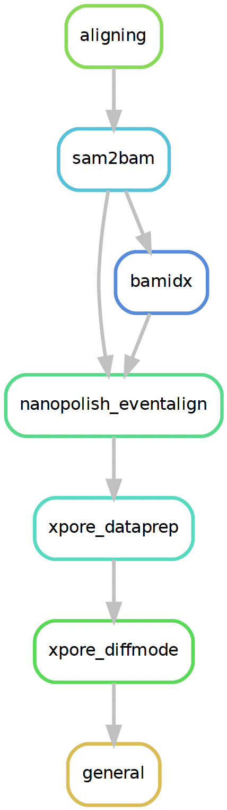

# BIOF501_term_project
# Differential RNA m6A methylation with Direct RNA sequencing 

1. [Cloning](#cloning)
2. [Environment](#python-3-environment)
3. [Snakemake usage of this repo](#snakemake-usage-of-this-repo)
4. [Perform the processing of a single sample](#perform-the-processing-of-a-single-sample)

<p align="lef">

</p>

## 1. Cloning

Clone this repository and also submodules not manageable by conda(or pip)

```bash
git clone --recursive ssh://git@svn.bcgsc.ca:7999/~jmgarant/direct_rna.git
```

## 2. Python 3 environment

This repository has been developped using python3.7.3 through python3.7.6 in a
[miniconda](https://docs.conda.io/en/latest/miniconda.html) environment.

Though [conda](https://docs.conda.io/projects/conda/en/latest/) is not
required, it is highly recommended in order to manage the dependencies.
Users can choose to manage their dependencies manually and should consult
the `envs/environment.yaml` file as reference.

__Using snakemake to manage the environment__

From a bash terminal:

```bash
snakemake --use-conda --conda-create-envs-only --cores [cores available]
```

__Using conda to install the environment manually.__

```bash
conda env create --file envs/environment.yaml

conda activate direct_rna

snakemake [args]
```

## 3. Snakemake usage of this repo

All scripts, steps and jobs are managed using
[snakemake](https://snakemake.readthedocs.io/en/stable/#)

Input files, workflow parameters and output path are provided through config
files (`configs/*.yaml`).

The workflow is designed to compare direct-RNA samples.

```bash
# To display the jobs and commands including subworkflows
snakemake -np

# to visualize the acyclic rulegraph
snakemake --rulegraph | dot | display -

# To launch the jobs
snakemake --use-conda
```

An example of snakemake profile for "numbers" cluster is available at
`configs/smk_profiles/numbers/config.yaml` and a second one for "slurmgpu" will
be available eventually.

## 4. Perform the processing of a single sample

So far the processing of a sample includes basecalling, polyA tail estimation,
gene/isoform expression and match to Illumina gene expression (if available in
Flair configs, see config file).

Config files contains the values of variables needed to perform analyses.

`configs/sample_config.yaml` is under development and is provided as an 
example. It's meant to be used to apply the analyses on those first data
available from the PromethION platform.

Most of the data directories hosting results will be created *ad-hoc* by the
snakemake manager, although it is possible to create the folders in advance.
**Any of these folders can be replaced by a symlink in order to redirect
voluminous files to appropriate spaces.** The entire `data/` folder can be
written to a project space with a simple:

`ln -s /PATH/TO/SCRATCH/data data`

It is recommended to use symlinks to redirect the data/ folder to a scrath
space since the outputs can get particularly large.
